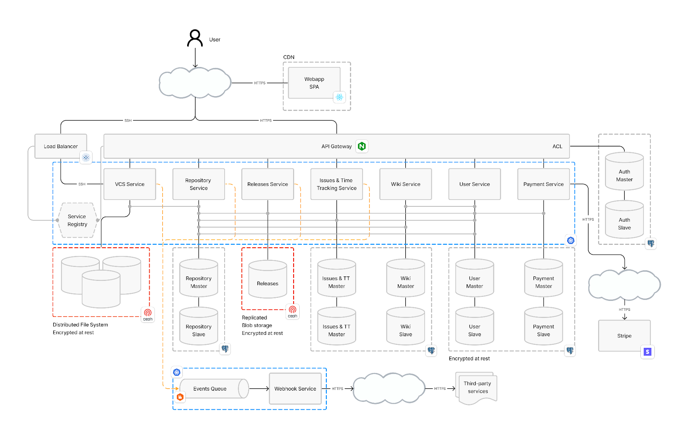

# TP Final - Ingenieria del Software 2

## Autores:
  - [Margenat, Matias](https://github.com/nicklnick)
  - [Paredes, Elian](https://github.com/elianparedes)
  - [Castañeda, Saul](https://github.com/saulex16)
  - [Burda, Juan](https://github.com/Juan-Burda)
  - [Gronda, Marcos](https://github.com/MSGronda) 

## Descripción:
Diseñamos la arquitectura de un sistema similar a Github o Gitlab, el cual permite almacenar repositorios Git, SVN, Mercurial, Perforce, generar issues, wikis, etc. Para el diseño se relevaron multiples soluciones tecnicas, justificando en el caso que se haya usado uno. También se especificaron los atributos de diseño a priorizar para dicho sistema.

## Arquitectura:

## Correcciones:
- El diagrama es poco claro, incluyendo líneas de diversos colores sin una leyenda que permita su interpretación.
- El servicio de Service Discovery es innecesario y extremadamente complejo. El uso de DNS vía K8S alcanza para cubrir esta necesidad.
- La elección de PostgreSQL carece de análisis apropiado. El informe no detalla nada, pero la defensa muestra algún análisis de throughput. Sin embargo, nunca analizaron el volúmen de información a manipular, el cual es excesivo para una base relacional en entidades como issues.
- Su nota de final es un 7

